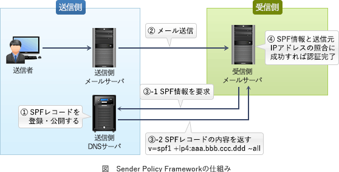
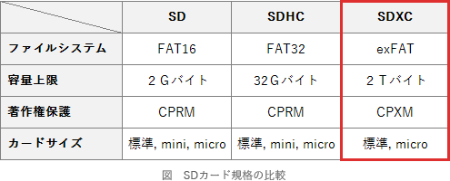
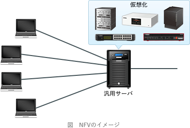

# 単語リスト

## <strong>スクラム</strong>

```txt
複雑なプロダクトを開発・維持するためのアジャイル開発のフレームワークです。

プロダクトオーナ
    プロダクトに必要な機能を定義し、プロダクトバックログの追加・削除・順位
    付けを行う。

開発者
    機能横断的な様々な技能を持った人がプロダクトを中心に集まり、自律的に行動
    する。

スクラムマスタ
    スクラムチーム全体が自律的に協働できるように、場づくりをするファシリテーター
    的な役割を担う。
```

<br>

## <strong>フェーズゲート</strong>

```text
プロジェクトの開始、組織編成と準備、作業の遂行、プロジェクトの完了などの各
プロジェクト・フェーズの終了時に実施するレビュー
```

<br>

## <strong>プレシデンスダイアグラム法</strong>

```text
個々の作業を四角で囲み、作業同士を矢印で結ぶことで作業順序や依存関係を
表現する図法です。
```

<br>

## <strong>定量評価</strong>

```text
リスクの大きさを金額（数値）で表す評価手法です。
```

<br>

## <strong>DSP(Digital Signal Processor)</strong>

```text
主にリアルタイムコンピュータで使用される、ディジタル信号処理に特化した
プロセッサです。
```

<br>

## <strong>有機 EL ディスプレイ</strong>

```text
電圧を加えると発光する有機化合物で出来た発光層を使用したディスプレイです。
```

<br>

## <strong>ストアドプロシージャ</strong>

```text
データベースに対する一連の処理をまとめた手続きにして、データベース管理システムに
保存したものです。
```

<br>

## <strong>SFA(Sales Force Automation)</strong>

```text
営業活動にモバイル技術やインターネット技術といったITを活用して、営業の質と
効率を高め売上や利益の増加につなげようとする仕組み、またはそのシステムのことです。
```

<br>

## <strong>ロングテール</strong>

```text
膨大な商品を低コストで扱うことができるインターネットを使った商品販売において、
実店舗では陳列されにくい販売機会の少ない商品でも、それらを数多く取りそろえる
ことによって十分な売上を確保できることを説明した経済理論です。
```

<br>

## <strong>MMU(Memory Management Unit，メモリ管理機構)</strong>

```text
主記憶を管理するためのハードウェア機構で、アドレス変換機能やメモリ保護機能、
キャッシュ制御機能、及びバス調停機能などを持っています。
```

<br>

## <strong>ROI(Return On Investment，投資利益率)</strong>

```text
効果金額を投資額で割ったもので、投資額に対してどれだけ経常利益を生み
出しているかを見る尺度です。
```

<br>

## <strong>ニモニックコード(Mnemonic Code)</strong>

```text
表意コードとも言い、値から対象のデータが容易に連想できる英数字・記号の
組合せをコードとして割り当てる方法です。
```

<br>

## <strong>JavaBeans</strong>

```text
プログラムの再利用を目的としてJavaで書かれたソフトウェアの部品です。
```

<br>

## <strong>PWM(Pulse Width Modulation，パルス幅変調)</strong>

```text
信号の強度は一定のままパルス信号を出力する時間(width)を長くしたり短くしたり
することで電流・電圧を制御する方式で、インバータの制御方式として用いられています。
```

<br>

## <strong>サービスレベル管理(Service Level Management)</strong>

```text
顧客とサービス提供者の間でSLA(Service Level Agreement)を締結し、
サービスレベルを定義，合意及び管理するプロセスです。
```

<br>

## <strong>プリエンプション方式</strong>

```text
OSがCPUやシステム資源を管理し、CPU使用時間や優先度などによって複数の
タスクを実行状態や実行可能状態へ切替えながら実行していくマルチタスクの方式です。

プリエンプション(Preemption)とは、実行状態にあるタスクがCPUの使用権を奪われ
実行可能状態に移されることをいい、以下のいずれかの状態になったときに起こります。
```

<br>

## <strong>ペネトレーションテスト(Penetration Test)</strong>

```text
ネットワークに接続されているシステムに対して、実際に様々な方法で侵入や
攻撃を試みることで脆弱性の有無を検査するテストです。
```

<br>

## <strong>問題管理プロセス</strong>

```text
インシデントや障害発生の根本原因を突き止め、インシデントの再発防止の
ための恒久的な解決策を提示することを目的とするプロセスです。
```

<br>

## <strong>ピアレビュー(Peer Review)</strong>

```text
「ピア(peer)」には同僚という意味があり、ドキュメントやコーディング作業が
終了したソースコードに対して、作成者の同僚や研究仲間など立場の近いもの
同士が実施しあうレビューのことをいいます。
```

<br>

## <strong>共通フレーム</strong>

```text
ソフトウェアライフサイクルにかかわる諸活動を網羅的に定義した百科事典の
ようなもので、そのまま適用するのではなく利用の局面において対象とする
プロジェクトの範囲や重要度に応じた修整が必要となります。
修整(tailoring)とは、使用する開発モデルに合わせてアクティビティや
タスクを取捨選択する作業で、共通フレームを適用する上での必須の活動です。
```

<br>

## <strong>RFI(Request for Information，情報提供依頼書)</strong>

```text
企業・組織がシステム調達や業務委託をする場合や、初めての取引となる
ベンダ企業に対して情報の提供を依頼すること、またはその際に提出される
文書のことをいいます。
```

<br>

## <strong>ディジタルフォレンジックス</strong>

```text
不正アクセスや情報漏えいなどのセキュリティインシデントの発生時に、
原因究明や法的証拠を保全するために対象となる電子的記録を
収集・解析することです。
```

<br>

## <strong>ゼロデイ攻撃</strong>

```text
あるOSやソフトウェアに脆弱性が存在することが判明し、ソフトウェアの
修正プログラムがベンダーから提供されるより前に、その脆弱性を
悪用して行われる攻撃のことを指します。

```

<br>

## <strong>M&A</strong>

```text
合併(Mergers)と買収(Acquisitions)を組み合わせた言葉で、他社を自社に
吸収合併したり、他社の株式を多く取得し買収することで子会社化することです。

垂直統合型
    生産を行う工場が「部品工場」や「営業会社」等のサプライチェーンの
    上流や下流にある工程を企業グループに統合することで市場競争力や
    資材の供給力を高める形のM&A。

水平統合型
    同業他社を買収する形のM&A。市場シェアや事業規模を拡大する目的など
    で実施される。

混合型
    異業種との合併となるM&A。新規分野・新規市場に進出する目的などで
    実施される。
```

<br>

## <strong>候補キー(Candidate Key)</strong>

```text
主キーの候補となるキーのことで、表の中の1つのレコードを特定できる
性質を持つ属性、または属性の組合せです。
```

<br>

## <strong>デマンドページング</strong>

```text
デマンド(demand)とは要求を意味する英語で、その名の通りアクセス要求が
あった時に要求があったページのみを主記憶に読み込む方式。
```

<br>

## <strong>プリページング</strong>

```text
ページにアクセス要求がある前に、前もって参照されそうなページを
主記憶に読み込んでおく方式。
```

<br>

## <strong>ファンクションポイント法</strong>

```text
システムやプログラムの機能に基づいて全体の開発規模を見積もる手法で、
外部入出力や内部ファイルの数と難易度の高さから論理的にファンクション
ポイントを算出して規模や工数見積りを行います。
```

<br>

## <strong>アンチエイリアシング(anti-aliasing)</strong>

```text
ディジタル画像の物体の輪郭に現れるピクセルのギザギザ（ジャギー）を、
なめらかに見せるために周囲(背景)の画素値と平均化処理をして描画する
CG技法です。
```

<br>

## <strong>フォロー･ザ･サン</strong>

```text
2つ以上の異なる(大陸の)拠点に配置され、中央での統括管理によって
24時間365日のサービスを提供するサービスデスク。
```

<br>

## <strong>状態遷移図</strong>

```text
コンピュータのタスクの状態変化やリアルタイム処理の状態変化など、
時間の経過や状態の変化に応じて状態が変わるようなシステムの
振る舞いを記述するときに適した図式化手法です。
```

<br>

## <strong>SOA(Service Oriented Architecture)</strong>

```text
従来ソフトウェアで実現されていた機能や部品を独立したサービスとして公開し、
それらを組み合わせてシステムを構築するという考え方です。
```

<br>

## <strong>オムニチャネル(Omni Channel)</strong>

```text
販路として展開する実店舗、ECサイト、カタログ通販、
モバイル端末などのシステムや仕組みをシームレスに連携・融合させ、
どの方法でも同レベルの利便性で注文・購入できるようにした
販売環境のことです。
```

<br>

## <strong>EDI(Electronic Data Interchange)</strong>

```text
電子データ交換と訳され、異なる組織間で取引のためのメッセージを
通信回線を介して標準的な規約を用いて、コンピュータ（端末を含む）間で
交換する仕組みのことです。
```

<br>

## <strong>3 層クライアントサーバシステム</strong>

```text
ユーザの入出力を担当するプレゼンテーション層，業務処理に依存する
データ加工を行うファンクション層，データベース処理を行うデータ層の
3層に機能を分離したシステムモデル
```

<br>

## <strong>ノンプリエンプティブ</strong>

```text
マルチタスクOS上で実行されているタスクの切替をプログラム自身に任せ、
プログラムがCPUを自発的に開放したタイミングで他のタスクへの切り替えを
行うマルチタスク制御方式のことをいいます。
```

<br>

## <strong>事前評価</strong>

```text
実施前の投資案件に対して、内部の了解を得るとともに他のプロジェクトとの
整合などの全体最適の観点から評価を行う。投資実行の可否を判断するための
情報を提供する役割を担う。
```

<br>

## <strong>スタックポインタ</strong>

```text
スタックの最上段のアドレスを保持するレジスタで、スタック内で最後に
参照されたアドレスを保持しています。
```

<br>

## <strong>フェールセーフ</strong>

```text
システムの不具合や故障が発生したときでも、障害の影響範囲を最小限にとどめ、
常に安全を最優先にして制御を行う考え方です
```

<br>

## <strong>IT サービスメネジメントにおける構成管理</strong>

```text
すべてのIT資産を明確化し、これらの維持管理や他のプロセスが効率的な
サービスを提供できるように構成情報の提供を行うプロセスです。
```

<br>

## <strong>SRI(Socially Responsible Investment)</strong>

```text
社会的責任投資と訳され、企業への株式投資の際に、財務的分析に加えて、
企業の環境対応や社会的活動(CSR活動)などの評価、つまり企業の社会的責任の
評価を加味して投資先企業を決定し、かつ責任ある株主として行動する
投資手法です。
```

<br>

## <strong>4C</strong>

```text
Customer value（顧客価値）
Customer cost（顧客コスト）
Convenience（利便性）
Communication（コミュニケーション・対話）
```


<br>

## <strong>液晶ディスプレイ(LCD:Liquid Crystal Display)</strong>

```text
外光や、フロントライト、バックライト等の光源により発せられた光を部分的に
遮ったり透過させたりすることによって表示を行なうディスプレイです。
```

<br>

## <strong>Man-in-the-Browser 攻撃(MITB)</strong>

```text
ユーザPC内でプロキシとして動作するトロイの木馬(マルウェア)によって
Webブラウザ～Webサーバ間の送受信をブラウザベースで盗聴・改ざんする攻撃です。
```

<br>

## <strong>PM 理論</strong>

```text
リーダシップは「P機能」と「M機能」という2つの柱で構成されているとする理論で、
2つの機能の強弱の組合せでリーダのタイプを類型化して表します。

P機能(Performance function)
    計画立案、指示、叱咤などによってチームの生産性を高め、目標達成に向けて
    チームをけん引していく能力

M機能(Maintenance function)
    チーム構成員同士の人間関係を良好に保ち、チームワークを深める能力
```

;

<br>

## <strong>プロジェクトマネジメントオフィス(PMO:Project Management Office)</strong>

```text
企業内で並行して実施されている個々のプロジェクトのマネジメント業務の支援、
プロジェクトマネージャのサポート、部門間の調整などプロジェクトが円滑に
実施されるように支援を行う専門の部署です。
```

<br>

## <strong>同期制御</strong>

```text
2つの処理の待ち合わせが行われます。一方の処理が先に終了した場合でも、
その先の処理に進まず、二重線が示すポイントでもう一方の処理の終了を待ちます。
```

<br>

## <strong>SEO(Search Engine Optimization)</strong>

```text
Webサイトを制作するときに、Googleなどの検索エンジンの検索で上位に
表示されることを目指してページやサイト全体を最適化することをいいます。
```

<br>

## <strong>ライブマイグレーション</strong>

```text
ある物理サーバ上で稼働している仮想マシンを、OSやソフトウェアを停止させる
ことなく別の物理サーバに移し替え、処理を継続させる技術です。
```


<br>

## <strong>アクチュエータ</strong>

```text
力された電気信号を力学的な運動に変換する駆動機構で、機械や電気回路の
構成要素です。
```

<br>

## <strong>パワーゲーティング</strong>

```text
集積回路内の使用していない演算回路ブロックへの電源を遮断することで
リーク電流の削減を図る技術です。

```

<br>

## <strong>インスペクション</strong>

```text
事前に役割を決められた参加者が責任のある第三者(モデレータ)の下で成果物を
確認する、最も公式なレビュー技法です。
```

<br>

## <strong>VRRP(Virtual Router Redundancy Protocol)</strong>

```text
ネットワークのデフォルトゲートウェイとなるルータやL3スイッチの冗長構成を
実現するプロトコルです。
```

<br>

## <strong>値呼出し(call by value)</strong>

```text
引数に変数が保持する値のコピーを入れて渡す方法。
※元の変数の値には反映されない。
```

<br>

## <strong>参照呼出し(pass by reference)</strong>

```text
引数として変数のポインタ(メモリアドレス)を渡す方法。
※元の変数の値にも反映される。
```

<br>

## <strong>サブミッションポート</strong>

```text
ユーザーのメールソフト(メーラー)からメールサーバにメールを届ける
ときに使用する送信専用のポート番号です。
```

<br>

## <strong>リエントラント(Reentrant，再入可能)</strong>

```text
各プロセスごとに変数部分を割り当てることで、複数のプロセスで同時に
実行できる性質。
```

<br>

## <strong>ヒープソート</strong>

```text
未整列データを「親の値≦子の値」(または「親の値≧子の値」)の関係をもつ順序木として表現し、
整列後の根の値(最小値または最大値)を取り出すことを繰り返して整列を行う方法です。
```

<br>

## <strong>パッシブタグ(受動タグ)</strong>

```text
電池を内蔵せず、リーダ／ライタが発信する電波をエネルギー源として利用して駆動するタグ。
```

<br>

## <strong>サンドボックス</strong>

```text
外部から受け取ったプログラムを保護された領域で動作させることによってシステムが不正に
操作されるのを防ぎ、セキュリティを向上させる仕組みです。
```

<br>

## <strong>受容</strong>

```text
リスクが現実化した時の影響が許容可能範囲内である場合やリスクの除去が困難であるときに、
特に対策をせずにそのままにしておく戦略。
```


<br>

## <strong>リスクベース認証</strong>

```text
通常とは異なる環境(例えば、普段とは異なるIPアドレスやISP及びOSやWebブラウザ等)からの
認証要求があった場合に、通常の認証に追加する形で別の認証を実施する方式です。
```

<br>

## <strong>アクタ</strong>

```text
システムのユーザが果たす役割を表し、システムと活発に情報交換をしたり、システムから
受動的に情報を受け取ったりする。人間、ハードウェア、外部システムがアクタになりえる。
```


<br>

## <strong>SPF(Sender Policy Framework)</strong>

```text
SMTP接続してきたメールサーバのIPアドレスを基に、正規のサーバから送られた電子メールか
どうかを検証する技術です。受信メールサーバ側にて電子メールの送信元ドメインが詐称され
ていないかを検査できます。
```



<br>

## <strong>リバースエンジニアリング</strong>

```text
既存ソフトウェアの動作やそのソースプログラムを解析するなどして、製品の仕組み、
構造・構成技術等を調査し、そこから製造方法や動作原理、設計図、ソースコードなどの
情報を得る手法です。
```

<br>

## <strong>アンゾフの成長マトリクス</strong>

```text
縦軸に「市場」、横軸に「製品」をとり、それぞれに「既存」「新規」の2区分を設け、
4象限(市場浸透，製品開発，市場開拓，多角化)のマトリクスとしたものです。
```


<br>

## <strong>非機能要件</strong>

```text
業務要件を実現するためのシステムに求められる要件のうち、機能要件以外の要件のことです。
一般に制約条件や品質要求がこれに該当します。共通フレーム2007では、非機能要件に
記述する事項の例としてJIS X 0129-1(ISO/IEC 9126)における6つの「品質特性」のほか、
「技術要件」「運用・操作要件」「移行要件」「付帯作業」を挙げています。
```

<br>

## <strong>OP25B(Outbound Port 25 Blocking)</strong>

```text
ISP管理下の動的IPアドレスからの電子メール送信について、管理外ネットワークの
メールサーバへSMTP通信を禁止することで、ISPのメールサーバを介さずに外部の
オープンリレーサーバと直接コネクションを確立して送信されるスパムメールを防ぎます。

```

<br>

## <strong>ガーベジコレクション</strong>

```text
プログラムが動的に確保したメモリ領域を回収して、再度使用可能にすることを
いいます。
```

<br>

## <strong>SOAP</strong>

```text
ソフトウェア同士がメッセージを交換する遠隔手続き呼び出し(RPC)のための
プロトコルです。
```

<br>

## <strong>チャレンジレスポンス方式</strong>

```text
通信経路上に固定パスワードを流さないようにすることで、盗聴によるパスワードの
漏えいやリプレイアタックを防止する認証方式です。
```


<br>

## <strong>VLIW(Very Long Instruction word)</strong>

```text
プログラムのコンパイル時に依存関係のない複数の命令を１つの複合命令とし、
同時に実行させる手法です。
```

<br>

## <strong>死の谷</strong>

```text
技術経営の成功を阻む障壁を表す言葉で、研究開発の成果が製品化が結び付かない
状況を表します。
```

<br>

## <strong>産業財産権</strong>

```text
著作権と並び知的財産権に分類される権利です
```


<br>

## <strong>導出表</strong>

```text
1つ以上の基礎となる実表(DBに実データを持つ表)から関係演算・集合演算といった
SQL問合せによって作成される仮想的な表全般を指します。
```

<br>

## <strong>メモリインタリーブ</strong>

```text
物理上は1つである主記憶領域を、同時アクセス可能な複数の論理的な領域(バンク)に分け、
これに並列アクセスすることで見かけ上のアクセス時間の短縮を図るメモリアクセス
高速化技術です。
```


<br>

## <strong>ベンチマーキング</strong>

```text
自社の製品・サービス及びプロセスを定量的・定性的に測定し、それを業界で最も成功を
収めている企業(ベスト企業)のものと比較し、そのギャップを把握する分析手法です。
```

<br>

## <strong>ハイブリッド暗号方式</strong>

```text
公開鍵暗号方式を用いて共通鍵を通信相手へ安全に配送し、以後はその共通鍵を使用して
暗号化通信を行う方式です。TLSやS/MIMEで採用されています
```

<br>

## <strong>ディジタルサイネージ(Digital Signage，電子看板)</strong>

```text
ディジタル技術を活用して平面ディスプレイやプロジェクタなどに映像や情報を表示する
広告媒体のことです。
```

<br>

## <strong>ファジング</strong>

```text
検査対象のソフトウェア製品に「ファズ（英名：fuzz）」と呼ばれる問題を引き起こしそうな
データを大量に送り込み、その応答や挙動を監視することで(未知の)脆弱性を検出する検査手法です。
```


<br>

## <strong>サンドボックス</strong>

```text
外部から受け取ったプログラムを保護された領域で動作させることによってシステムが不正に操作され
るのを防ぎ、セキュリティを向上させる仕組みです。
```


<br>

## <strong>ブロックチェーン</strong>

```text
仮想通貨(暗号通貨)の基盤技術であり、"ブロック"と呼ばれる幾つかの取引データをまとめた単位を
ハッシュ関数で鎖のように繋ぐことによって、台帳を形成し、P2Pネットワークで管理する技術です。
分散型台帳技術とも呼ばれます。
```


<br>

## <strong>EMS</strong>

```text
電子機器の設計から製造までを専門に受託するサービスのことです。
```

<br>

## <strong>SysML</strong>

```text
ソフトウェア設計の用いられるUMLを、ハードウェアに関する記述を含めたものに拡張し、
システム設計を行えるようにしたモデリング言語です。
```

<br>

## <strong>SDXC</strong>

```text
2009年に策定された規格で、ファイルシステムにexFATを採用することで記憶容量の上限を
2Tバイトまで引き上げたものです。
```



<br>

## <strong>NFV(Network Functions Virtualisation，ネットワーク機能の仮想化)</strong>

```text
仮想化技術を利用して、従来はルータ、スイッチ、ファイアウォール、ロードバランサなどの
専用機器で行われていた機能を、汎用サーバ内の仮想マシン上で動くソフトウェアとして実装する
アーキテクチャです。
```



<br>

## <strong>思考発話法</strong>

```text
被験者にタスクを実行してもらい、その操作を行っている間、考えたことや感じたことを口に
出してもらうことで利用者の感じ方や思考を分析する手法。
```

<br>

## <strong>サーバコンソリデーション</strong>

```text
仮想化技術を用いることで、複数の専用サーバに分散・非効率化していたアプリケーションや
機能を1台(または少数)の物理サーバに整理統合することです。物理サーバの台数が減るので、
保守費用、消費電力、設置スペースなどの維持管理コストの削減を図ることができます。
```

<br>

## <strong></strong>

```text

```

<br>

## <strong></strong>

```text

```

<br>

## <strong></strong>

```text

```

<br>

## <strong></strong>

```text

```

<br>

## <strong></strong>

```text

```

<br>

## <strong></strong>

```text

```

<br>

## <strong></strong>

```text

```

<br>

## <strong></strong>

```text

```

<br>

## <strong></strong>

```text

```

<br>

## <strong></strong>

```text

```

<br>

## <strong></strong>

```text

```

<br>

## <strong></strong>

```text

```

<br>

## <strong></strong>

```text

```

<br>

## <strong></strong>

```text

```

<br>

## <strong></strong>

```text

```

<br>

## <strong></strong>

```text

```
